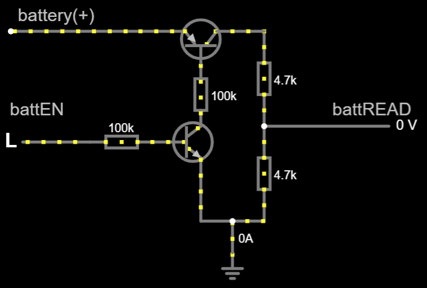
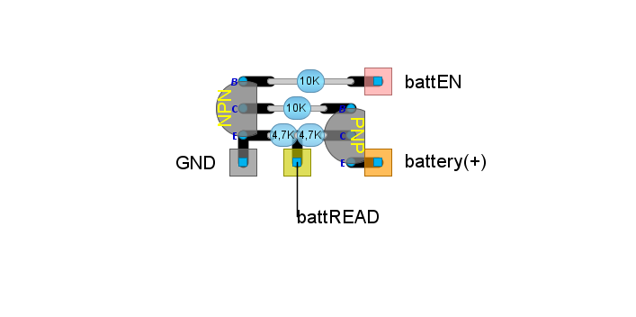

# Subsistema monitor de batería

Este subsistema es para una configuración **que funcione con batería**. No tiene sentido si hay una fuente de alimentación externa instalada.

## Objetivo

El propósito de este subsistema es proporcionar una estimación de cuánta carga queda en la batería, para que el usuario sepa cuándo enchufar el cable de carga. El nivel de la batería es un porcentaje de carga restante en el rango de 0% a 100%. EL PC anfitrión conoce el nivel de la batería a través de Bluetooth Low Energy.

## Circuito

Este circuito está diseñado para baterías de polímero de litio (LiPo) "1S". Es posible que se requieran algunos ajustes para otros tipos de baterías.

### Principios de funcionamiento

Un monitor de batería necesita leer el voltaje de salida de la batería (*no* el voltaje de salida del módulo powerboost), es decir, el voltaje en el terminal positivo (el terminal negativo está conectada a tierra ("GND") en el módulo powerboost). A medida que la batería se descarga, ese voltaje bajará. El voltaje de salida de una batería LiPo está en este rango (más o menos):

- 4V a 5V cuando el módulo powerboost está cargando la batería.
- 3,7V cuando la batería está completamente cargada.
- Alrededor de 2,4V o menos cuando la batería está descargada. El módulo powerboost cortará la energía para evitar una descarga excesiva.

De alguna manera, este voltaje de salida debe leerse a través de un pin ADC, sin embargo, existen dos restricciones:

- El voltaje de salida de la batería supera los 3,3V y dañaría la placa DevKit, por lo que el voltaje debe caer a un rango adecuado.
- Leer el voltaje de salida podría descargar la batería, por lo que el monitor de batería no debería consumir ninguna corriente relevante. El firmware leerá el nivel de la batería cada pocos minutos y solo toma unos pocos milisegundos. De esta manera, se conserva la carga de la batería. El circuito se enciende y apaga por medio de un par NPN-PNP.


### Diseño del circuito

El circuito tiene las siguientes entradas:

- Pin **Battery (+)** (terminal positivo de la batería): se debe soldar un cable a ese terminal en el módulo powerboost.
- pin **battEN**: habilita o deshabilita el circuito. Conectado a un pin GPIO con capacidad de salida en la placa DevKit.

Y una salida:

- Pin **battREAD**: proporciona el nivel actual de la batería. Conectado a un pin GPIO compatible con ADC en la placa DevKit.

El pin `GND` se comparte con el circuito principal, conectado a `GND` en el módulo powerboost.



[Esta simulación en falstad.com](https://falstad.com/circuit/circuitjs.html?ctz=CQAgjCAMB0l3BWcMBMcUHYMGZIA4UA2ATmIxAUgoqoQFMBaMMAKABcQmwVxieHCAFl48eEGAkJhsKFGEEJKmSGCQS80yNjx4peFUPJg4IACZ0AZgEMArgBs2LAOacZIXMIZuZVXywDunPogwQzBfgBOUCG+4BiE0YIYcCxRVGDx0Zg8VEkpUUyZYHyczGIl6fCQqZxC4Ny1whkJlVUBrjweHSDZ4O1UvV6iGDntAsKDdWh4UOyN9fx1wdilnBLGxIQofMSCKEkYBGvQCATYW4TYgnh8CKorxlTm1vaOADKlRSUMKJIi0RBrHYAM50dzQFbVQIMa4xaLhFgAeQBRUETSKs2hbkmExGswAHqVIJ4VgwMMREiAEgAjKxsNh0CIATwAFAAdAAOAEoWISfggjIQkD9IGJCDMmjNafSAKIAOV5VIpYCF4EEyvFIElIGlbAASjKAIIAERYAGUgrEmIRYlQEkDQdEMCw9aUbZxYUxvrDYoJaNFfCcXW6qENOLISTlErkA1Ag67raGVaVvsnfVRsNByLb4yHwAkvWLY373LGJMHE9Efvsy1qMxCy7nK25q8I3OmelnGwgKyrcjNC1qZh2UA2cz2+YNBAXfhAYSsmlQALKGgAaiq8e1cc9+oZQEuQIAAwgALKwRJwASwAdk42cCAPT3o-npxWa+mAD2G+w2GFDX5UMKUXY8zwvOhTHvJ9gRfC8rFMKwfyuGhw1kCgF0PY1L2BABjMCnAgqD72NOhcNfeDEOpVxp1qMRkLqao+S2D16gHCAmgSM1LwAW3sOlCOBXVGSZe8ADdPwcKwCI3DAIAycA0LQLV8xAAA1CS2CsAArOh73Me9pUZABbqx72BHi+K-FggA) muestra cómo funciona, pero tenga en cuenta que el rectángulo es no es parte del circuito.

Piezas necesarias:

- Resistencia de 100K-ohmios (x2)
- Resistencias de 4,7K-ohmios (x2) **1% de tolerancia**. Cualquier impedancia en el rango de 1K-100K ohmios funcionará, siempre que ambas sean idénticas.
- Un transistor de unión bipolar (x1), tipo NPN: cualquiera debería funcionar (por ejemplo: [BC637](https://www.onsemi.com/pdf/datasheet/bc637-d.pdf)).
- Un transistor de unión bipolar (x1), tipo PNP: cualquiera debería funcionar (por ejemplo: [BC640](https://www.onsemi.com/pdf/datasheet/bc640-d.pdf)).

Preste atención al patillaje de sus transistores. *Puede no coincidir* con el que se muestra aquí.

Mire esta [disposición del circuito](./BatteryMonitor.diy) usando [DIY Layout Creator](https://github.com/bancika/diy-layout-creator).




## Personalización de firmware

La personalización se realiza en el archivo [CustomSetup.ino](../../../../src/Firmware/CustomSetup/CustomSetup.ino).
Asegúrese de que la siguiente línea de código esté en su lugar:

```c
#define ENABLE_BATTERY_MONITOR
```

Localice la línea `#define BATTERY_ENABLE_READ_GPIO` y escriba un número GPIO a la derecha donde se conecta `battEN`. Localice la línea `#define BATTERY_READ_GPIO` y escriba un número GPIO a la derecha donde se conecta `battREAD`. Por ejemplo:

```c
#define BATTERY_ENABLE_READ_GPIO 0
#define BATTERY_READ_GPIO 36
```

Solo se puede proporcionar una estimación aproximada de la carga disponible de la batería. El nivel de la batería no será fiable hasta que la batería esté completamente cargada por primera vez.

Para obtener niveles precisos de la batería se puede seguir un procedimiento de calibración, que está ampliamente documentado [aquí](../../../../src/Firmware/BatteryTools/BatteryCalibration/README_es.md) junto con el firmware requerido.