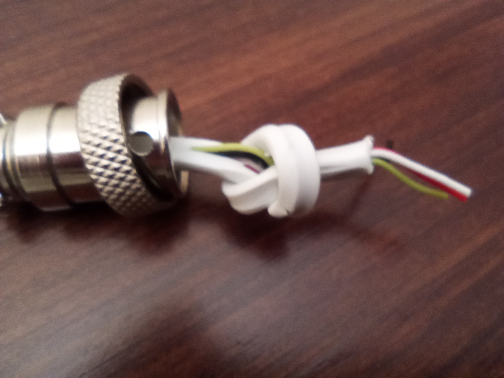

# Visión de conjunto

Hay algunos pasos básicos para construir un volante de bricolaje o una caja de botones:

1. Construya o compre un caracasa de volante (o caja de botones).
2. Construya la electrónica.
3. Junte todo.
4. Construya un puerto de carga de batería.

Sin embargo, esos son *no* pasos independientes. Se requiere suficiente espacio dentro de la carcasa para colocar los circuitos, botones, baterías y cables. Los componentes elegidos pueden interferir en el diseño de la carcasa y viceversa.

## Carcasa de volante

Hay tres opciones:

1. **Compre una carcasa ya hecha a un proveedor**
   
   Dado que el volante ya está diseñado y construido, hay poco márgen para la electrónica personalizada. Algunos proveedores conocidos son:
   
   - [3D-Rap](https://www.3drap.it/)
   
   - [The French Simracer](https://www.thefrenchsimracer.com/en/categorie-produit/diy-steering-wheel-kit/)
   
   - [Kapral Simracing](https://www.thefrenchsimracer.com/en/categorie-produit/bricolaje-volante-kit/)
   
   - [R Racing Shop](https://rracing.store/collections/diy-kits)
     
   Si conoce a otros proveedores, por favor, comparta su conocimiento.

2. **Compre un plano y constrúyalo**
   
   Los archivos de impresión 3D y CNC se compran a un proveedor, por lo que hay cierto márgen para la personalización si se tienen las habilidades. Esos archivos se pueden pasar a un fabricante local para impresión 3D o mecanización CNC. Algunos proveedores de planos conocidos son:
   
   - [Open Sim Racing](https://opensimracing.com/collections/race-wheel-plans)
   
   - [Hupske Sim Racing](https://www.hupskesimracing.com/store)
   
   - [AM Studio Projects](https://amstudioprojects.com/steering-wheels/)
     
    Si conoce a otros proveedores, por favor, comparta su conocimiento.

3. **Diseñe y construya su propia carcasa**
   
   Tiene control total sobre el diseño, por lo que todo puede encajar perfectamente. Sin embargo, es necesario tener las habilidades...
   
   Si ese es tu caso, por favor, considere contribuir con un diseño abierto a la comunidad.

## Construya la electrónica

Este es el tema principal de este proyecto. Los pasos son:

1. Elija un diseño de circuito listo para implementar o personalice uno de ellos. El software es lo suficientemente flexible como para adaptarse a muchas necesidades. Hay muchas disposiciones correctos del circuito para el mismo diseño eléctrico, por lo que hay varias posibilidades de alojar la electrónica en la carcasa. Sin embargo, debe planificar cuidadosamente qué componentes elegir.
2. Compre las piezas necesarias.
3. Construya el circuito.
4. Configure el entorno Arduino.
5. Compile y cargue el firmware.
6. Pruebe.

## Poner todo junto

Este es un paso directo: conecte botones, paletas y similares a la placa de circuito.

## Construya un puerto de carga de batería

El puerto de carga está compuesto por un cable USB y enchufes [GX16](https://duckduckgo.com/?q=GX16+plug&iax=images&ia=images) (macho y hembra). Corta el cable USB en dos partes, cerca del extremo micro-USB.

### Lado del volante

1. Conecte el enchufe macho GX16 a la carcasa.
2. Conecte el extremo micro-usb al módulo powerboost o la placa DevKit (según sea necesario).
3. Suelde, por separado, los cables rojo y negro a cualquiera de los pines, haciendo coincidir el enchufe hembra.

### Lado de la computadora

1. Inserte la cubierta GX16 en el cable USB.
2. Haga un nudo en el extremo cortado.

3. Suelde, por separado, los cables rojo y negro a cualquiera de los pines, haciendo coincidir el enchufe macho.